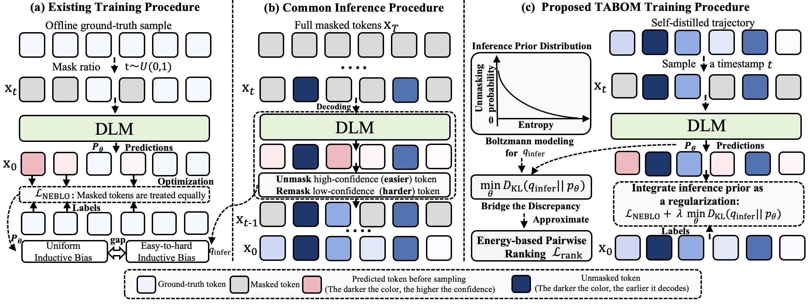

# TABOM

**Trajectory-Aligned Optimization via Boltzmann Modeling (TABOM)** — release code for training and evaluating TABOM post-trained diffusion language models.

## Overview

Diffusion Language Models (DLMs) have recently emerged as a promising alternative to autoregressive language models, offering stronger global awareness and highly parallel generation. However, post-training DLMs with standard Negative Evidence Lower Bound (NELBO)-based supervised fine-tuning remains inefficient: training reconstructs randomly masked tokens in a single step, whereas inference follows a confidence-guided, multi-step easy-to-hard denoising trajectory. Recent trajectory-based self-distillation methods exploit such inference trajectories mainly for sampling-step compression and acceleration, often improving decoding efficiency without substantially enhancing the model's underlying capability, and may even degrade performance under full diffusion decoding.

We propose **Trajectory-Aligned Optimization via Boltzmann Modeling (TABOM)**, a self-distilled trajectory-based post-training framework that aligns training with the easy-to-hard structure of inference. TABOM models the inference unmasking preference as a Boltzmann distribution over predictive entropies and derives a tractable pairwise ranking objective to align the model's certainty ordering with the observed decoding trajectory. Empirically, TABOM achieves substantial gains in new domains, expands the effective knowledge boundary of DLMs, and significantly mitigates catastrophic forgetting compared with standard SFT.




## Install

```bash
pip install -r requirements.txt
```

Requires Python 3.10+, a GPU, and Hugging Face access. If `lm_eval` fails with a numpy/pandas binary error: `pip install "pandas>=2.2.0"`.

## Data

You can download the self-distilled trajectories generated by us from [this Google Drive folder](https://drive.google.com/drive/folders/1GTh0X9ZiC16qfTbqVU8MRmoZmneMKxVk?usp=drive_link). Then, place them under `dream_post/data/` with these names (aligned with recipes in `run_tabom_examples.sh`):

| File | Recipe |
|------|--------|
| `dream_prm12k.jsonl` | `dream_prm12k` |
| `dream_ling_coder.jsonl` | `dream_ling_coder` |
| `llada_prm12k.jsonl` | `llada_prm12k` |
| `llada_ling_coder.jsonl` | `llada_ling_coder` |

## Where TABOM lives (core: `loss_rank`)

Standard release training uses **`--mask_schedule td`** plus **`--entropy_rank_reg`**. The NELBO-style masked CE (`loss_ce`) supervises token reconstruction in a time-delay window; the **TABOM-specific signal is the entropy ranking term `loss_rank`**, which pushes the model’s per-position confidence to follow the **easy-to-hard unmasking order** in the self-distilled trajectory.

**Total step loss** (`dream_post/train_tabom.py`):

```text
loss = loss_ce + entropy_rank_lambda * loss_rank
```

### Algorithm (one step)

```python
# inputs: decoding_order[], response labels; flags: mask_schedule=td, entropy_rank_reg
# hyperparams: td_supervision_window=M, entropy_rank_window=W, entropy_rank_margin=m,
#               entropy_rank_lambda=λ

cut[s] = sample_decode_cut(trajectory[s])          # TD; ling_coder may use non_ltr steps
x_in   = mask_tokens_with_step_ge(cut[s])         # partial denoise state
loss_ce = CE(logits(x_in), labels, steps in [cut[s], cut[s] + M))

neg_e = -shannon_entropy(softmax(logits))         # per response position; grad flows here
for s in batch:
    idx = positions where step in [cut[s], cut[s] + W) and supervised
    sort idx by decode_step (easy → hard)
    loss_rank[s] = mean( relu(neg_e[j] - neg_e[i] + m) for i,j in pairs, step[i] < step[j] )

loss_rank = mean(loss_rank[s])
loss = loss_ce + λ * loss_rank
```

Earlier decode steps should look **more confident** (lower entropy) than later ones inside the window — that is the TABOM signal beyond masked CE.

### Implementation (`loss_rank`)

The ranking block below is the main place to read when adapting TABOM (`dream_post/train_tabom.py`, ~L978–L1057). It runs only when `entropy_rank_reg` is on and `mask_schedule == "td"`; `td_cuts_for_entropy[b]` is the same cut `s_b` used for TD masking.

```python
    # ── Entropy-based ranking regularization (td, optional) ─────────────────────
    loss_rank = torch.tensor(0.0, device=device)

    if getattr(args, "entropy_rank_reg", False) and schedule == "td":
        # neg_entropy_full: (B, T_resp), keep grad for ranking reg on logits.
        probs_full = torch.softmax(resp_logits, dim=-1)
        log_probs_full = torch.log(probs_full + 1e-10)
        neg_entropy_full = torch.sum(probs_full * log_probs_full, dim=-1)

        rank_terms: List[torch.Tensor] = []
        rank_term_batch_idx: List[int] = []
        W_rank = max(1, int(getattr(args, "entropy_rank_window", 16)))
        margin = float(getattr(args, "entropy_rank_margin", 0.0))

        for b in range(B):
            decode_order = (
                decoding_order_batch[b]
                if decoding_order_batch is not None and b < len(decoding_order_batch)
                else None
            )
            if decode_order is None or len(decode_order) < T_resp:
                if schedule != "td":
                    continue
                steps = torch.arange(T_resp, device=device, dtype=torch.long)
            else:
                steps = torch.tensor(decode_order[:T_resp], device=device, dtype=torch.long)
            mask_b = mask_positions_resp[b]  # (T_resp,)
            valid_mask = (steps >= 0) & mask_b
            if valid_mask.sum().item() < 2:
                continue

            steps_valid = steps[valid_mask].to(torch.float32)
            neg_e_valid = neg_entropy_full[b][valid_mask]

            if (
                schedule == "td"
                and td_cuts_for_entropy is not None
                and td_cuts_for_entropy[b] is not None
            ):
                step_s_b = float(td_cuts_for_entropy[b])
            else:
                step_s_b = float(steps_valid.min().item())

            in_rank_window = (steps_valid >= step_s_b) & (steps_valid < step_s_b + W_rank)
            if not in_rank_window.any():
                continue
            win_idx = torch.where(in_rank_window)[0]
            if win_idx.numel() < 2:
                continue

            steps_win = steps_valid[win_idx]
            neg_e_win = neg_e_valid[win_idx]

            order_local = torch.argsort(steps_win)
            steps_ord = steps_win[order_local]
            neg_e_ord = neg_e_win[order_local]
            win_len = int(order_local.numel())

            if win_len >= 2:
                neg_i = neg_e_ord.unsqueeze(1)
                neg_j = neg_e_ord.unsqueeze(0)
                diff_mat = neg_j - neg_i
                triu_mask = torch.triu(
                    torch.ones(win_len, win_len, device=device, dtype=torch.bool), diagonal=1
                )
                pair_losses = F.relu(diff_mat + margin)[triu_mask]
                if pair_losses.numel() > 0:
                    rank_terms.append(pair_losses.mean())
                    rank_term_batch_idx.append(b)

        if rank_terms:
            loss_rank = torch.stack(rank_terms).mean()

    loss_ce = loss_vec.mean()
    loss = loss_ce

    if getattr(args, "entropy_rank_reg", False) and schedule == "td" and loss_rank > 0:
        lambda_rank = float(getattr(args, "entropy_rank_lambda", 0.1))
        loss = loss + lambda_rank * loss_rank
```

CLI flags (set in `run_tabom_examples.sh` per recipe): `--entropy_rank_reg`, `--entropy_rank_lambda`, `--entropy_rank_window`, `--entropy_rank_margin`, `--td_supervision_window`.

## Train and evaluate on GSM8K

Dream + prm12k TABOM (`gsm8k_cot`):

```bash
# Train
bash dream_post/run_tabom_examples.sh dream_prm12k train

# After training, evaluate (weights under checkpoints/dream_prm12k/train_<timestamp>/final/)
bash dream_post/eval_tabom.sh checkpoints/dream_prm12k/train_<timestamp>/final gsm8k_cot output_eval/my_run
```

Print commands without running: `DRY_RUN=1 bash dream_post/run_tabom_examples.sh dream_prm12k train`

For LLaDA + prm12k, use `eval_tabom_llada.sh` and `bash dream_post/run_tabom_examples.sh llada_prm12k train`.

## Evaluate the bundled checkpoint on GSM8K

Bundled LoRA: `checkpoints/dream_prm12k/` (`adapter_config.json` in that folder).

```bash
bash dream_post/eval_tabom.sh checkpoints/dream_prm12k gsm8k_cot output_eval/dream_prm12k_gsm8k
```

Or:

```bash
bash dream_post/run_tabom_examples.sh dream_prm12k eval
```

If you still have an `epoch_*` subfolder, run: `bash dream_post/rename_release_checkpoints.sh`
